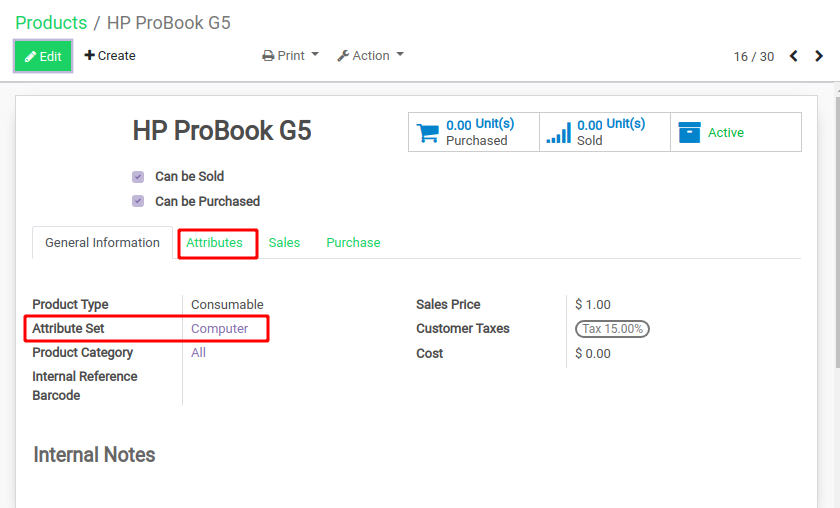

# Product Custom Attributes

Modules développés par Akrétion : [https://github.com/shopinvader/odoo-pim/pull/6](https://github.com/shopinvader/odoo-pim/pull/6)

## Objectif

Pouvoir créer n'importe quel type de **Champs personnalisable** d'Articles \(_Attribute_ en anglais\) et les associer à certaines **Familles d'Article** __\(_Atribute Set_\).

En choisissant la Famille d'un article, on fait apparaître les Champs personnalisables de cet article. Ainsi un article de la Famille des Tables pourra avoir des champs de dimension \(longueur, largeur, hauteur...\) qui n'apparaîtront pas dans les articles de la famille des Ordinateurs :

Ces Champs personnalisables peuvent être regroupés dans des **Catégories de champs** \(_Attribute Group_\) qui permettront de regrouper les champs à afficher dans des sous-onglets de l'onglet Attributes.

Un **Champ personnalisable** \(_Attribute_\) peut apparaître dans les **plusieurs Familles** d'articles \(_Attribute Set_\) mais il ne peut être que dans **une seule Catégorie de champs** \(_Attribute Group_\). On peut consulter la liste des différents Champs, Catégories de champs et Familles d'articles dans le Menu _Sales_ &gt; _Configuration_ :


Le module permet théoriquement la création de Champs pour d'autres objets Odoo que les Articles. Mais pour l'instant seuls les Champs personnalisables d'Articles sont affichés dans les fiches d'Articles.


## Usage

Dans le menu _Sale_ &gt; _Configuration_ &gt; _Attributes Set_, on crée une **Famille d'Articles** :

...à laquelle on associe des Champs personnalisables. Chaque Champ a de nombreux paramètres dont :

* son **Type**, à choisir parmi :
  * Char _\(Texte en ligne\)_
  * Text _\(Paragraphe\)_
  * Select _\(menu déroulant\)_
  * Multiselect _\(choix multiple\)_
  * Boolean _\(case à cocher\)_
  * Date
  * Datetime _\(Date avec heure\)_
  * Binary _\(photo, fichier pdf...\)_
  * Float _\(nombre à virgule\)_
  * Integer _\(nombre entier\)_
* Sa **Séquence** : l'ordre dans lequel il sera présenté par rapport aux autres Champs de la même Catégorie \(_Attribute Group_\).
* **JSON Field** : Tous les champs qui ont cette case cochée auront leurs valeurs regroupées au même endroit de la base de donnée sous la forme d'un gros fichier au [format JSON](https://fr.wikipedia.org/wiki/JavaScript_Object_Notation). Dans le cas de milliers d'Articles et de centaines de champs différents cela permet d'**accéder aux valeurs des champs en un temps record** en économisant le nombre de colonnes des Articles dans la base de donnée.


Les Catégories de Champs aussi ont un champs "_Séquence_" à définir. Cela donnera leur ordre d'apparition dans l'onglet "_Attribute_" de la fiche de l'Article pour les Articles qui ont des champs de plusieurs Catégories différentes


Pour les Champs personnalisables de type "_Select_" ou "_MultiSelect_" il est possible de **sélectionner d'autres Objets Odoo** qui auraient besoin d'être reliés à certains Articles. Pour activer cette fonctionnalité, il faut que l'utilisateur ait bien l'accès aux "_Advanced Attribute Options_" \(accessible via les paramètres de l'Utilisateur, en "[mode développeur](https://www.odoo.com/documentation/user/12.0/fr/accounting/others/reporting/customize.html#activate-the-developer-mode)"\) :

